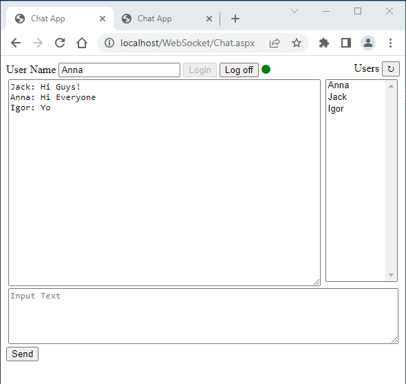
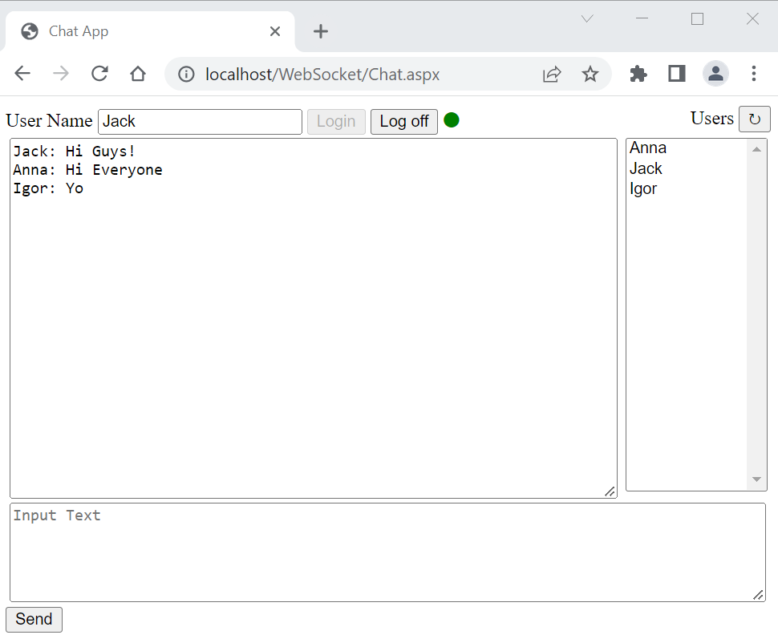
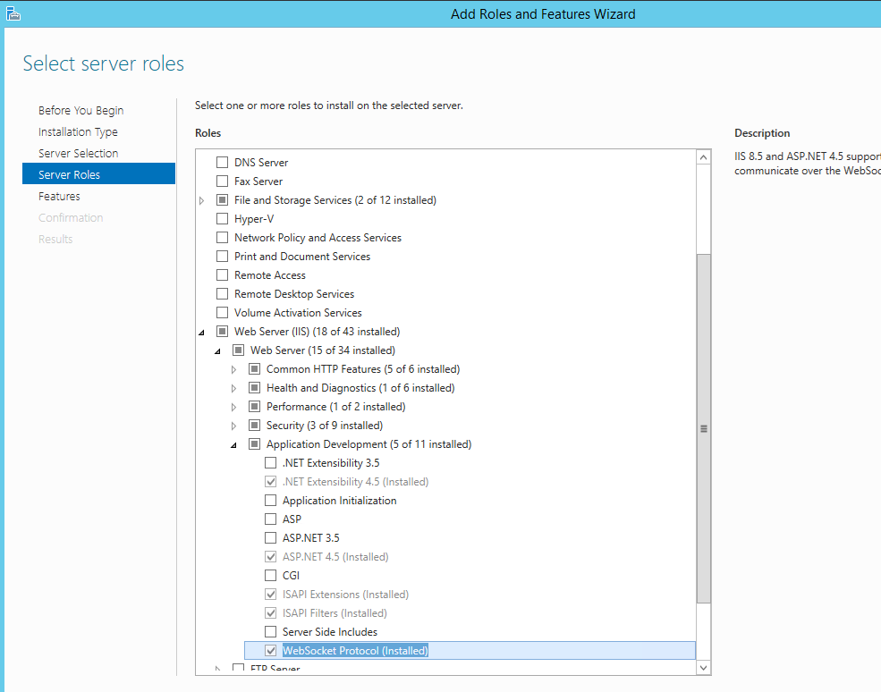
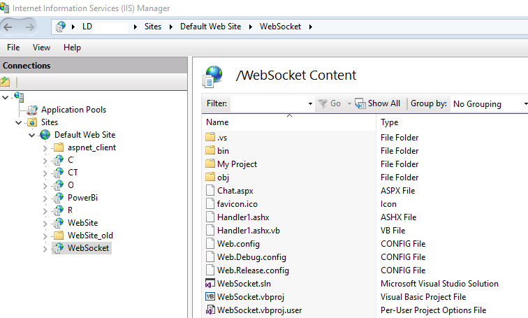
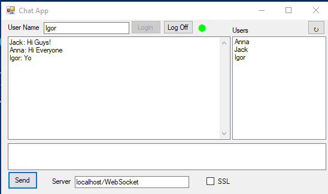

# Chat App with Web Sockets
Attempt to create a smallest chat application using Web Sockets

Originally posted here: https://www.codeproject.com/Articles/5338735/Chat-App-with-Web-Sockets

## Introduction
This application is my attempt to create a smallest chat application using Web Sockets. I am trying to use the least amount of code to show how to use Web Sockets. Web Sockets is the technology that lets you push the data from the web server to web browser.

## Background
To use Web Sockets, your web server needs to have ASP.NET 4.5 or higher and WebSocket Protocol installed under Add Roles and Features > Server Roles > Web Server > Web Server > Application Development > WebSocket Protocol.

## Using the Code
To setup the allocation, unzip WebSocket.zip to a C:\inetpub\wwwroot\WebSocket on your web server. Open IIS Console and create virtual directory called WebSocket.

Next, point your browser to http://localhost/WebSocket/Chat.aspx.

The web allocation has two files: Handler1.ashx and Chat.aspx. Handler1.ashx handler file handles WebSockets request. It handles web socket request with HandleSocketRequest function. The Async function loops if the socket connection is opened. It uses Await to wait for the message and then broadcasts the massage to all the registered users.

Chat.aspx file lets you login and broadcast message to all connected users. It is an ASP.NET web form that get the list of active users and uses JavaScript to send massage to Handler1.ashx.

As a bonus, I created a Windows app that connects to Handler1.ashx and acts in pretty much the same way as Chat.aspx except for using VB.NET instead of JavaScript. It opens a WebSocket connection and waits for the massage to arrive.

